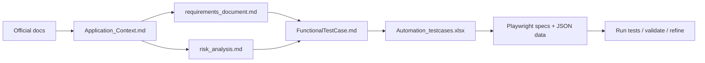

# Project Info — QA AI Practical Assessment

> AI-augmented QA for the [Practice Software Testing](https://practicesoftwaretesting.com) Toolshop — requirements, manual tests, and Playwright automation (API + UI).  
> Setup and run commands: [`README.md`](README.md)

## Table of Contents

1. [What Is This Project About?](#1-what-is-this-project-about)
2. [Primary AI Tool(s) Used](#2-primary-ai-tools-used)
3. [Providing Project and System-Under-Test Context](#3-providing-project-and-system-under-test-context)
4. [Requirement Analysis](#4-requirement-analysis)
5. [Test Planning and Strategy](#5-test-planning-and-strategy)
6. [Manual Test Case Design](#6-manual-test-case-design)
7. [Automation Design Using AI](#7-automation-design-using-ai)
8. [Validating and Refining AI Output](#8-validating-and-refining-ai-output)
9. [Test Data, Environment, and API Payloads](#9-test-data-environment-and-api-payloads-creation-using-ai)
10. [Debugging Failing Tests and Interpreting Logs](#10-debugging-failing-tests-and-interpreting-logs)
11. [Information to Avoid Sharing with AI](#11-information-to-avoid-sharing-with-ai)
12. [Reusing This QA Workflow in a Real Project](#12-reusing-this-qa-workflow-in-a-real-project)

### End-to-end workflow



### Key project artifacts

| Artifact | Purpose |
|----------|---------|
| `Application_Context.md` | SUT behaviour, accounts, business rules, API reference |
| `requirements_document.md` | 440 traceable `REQ-*` requirements |
| `risk_analysis.md` | High / Medium / Low risk → test priority |
| `FunctionalTestCase.md` | 95 manual test cases |
| `Automation_testcases.xlsx` | 9 cases selected for automation |
| `API/testdata/automation_testcases.json` | Maps manual case ID → data file → spec |
| `.cursor/Tool/.rules/` | Cursor conventions (POM, tags, document order) |
| `ai-prompts/` | Prompt and validation audit trail |

---

## 1. What Is This Project About?

A **QA practical assessment** demonstrating end-to-end quality engineering for the Practice Software Testing Toolshop (Sprint 5): requirement gathering, risk-based test design, requirements traceability, and Playwright automation for API and UI.

| Item | Value |
|------|-------|
| UI | https://practicesoftwaretesting.com |
| API | https://api.practicesoftwaretesting.com |
| Framework | Playwright Test + TypeScript |
| Manual tests | 95 (`FunctionalTestCase.md`) |
| Automated tests | 9 total — UI: 4 smoke + 1 regression; API: 3 smoke + 1 E2E |
| Requirements | 440 `REQ-*` IDs |

---

## 2. Primary AI Tool(s) Used

| Tool | Usage |
|------|-------|
| **[Cursor](https://cursor.com)** | Sole AI tool — documentation, requirements, test design, automation, debugging, refinement |

Used via chat prompts, `@` file references, and `.cursor/Tool/.rules/`. All prompts recorded in [`ai-prompts/`](ai-prompts/).

---

## 3. Providing Project and System-Under-Test Context to AI

Context is layered so Cursor understands the **project** (structure, conventions) and the **SUT** (Toolshop behaviour and acceptance criteria).

**Step 1 — Official documentation**  
Cursor read [Toolshop docs](https://testsmith-io.github.io/practice-software-testing/#/), live UI/API URLs, and Sprint 1–5 user stories with acceptance criteria.

**Step 2 — `Application_Context.md`** (primary SUT reference)  
Created from docs and acceptance criteria: overview, roles, accounts, features, business rules, workflows, user stories (Given/When/Then), and 87 API endpoints from [OpenAPI](https://api.practicesoftwaretesting.com/api/documentation).

**Step 3 — Derived documents**

| Document | Role |
|----------|------|
| `requirements_document.md` | 440 testable requirements with IDs |
| `risk_analysis.md` | Risk-based prioritisation |
| `FunctionalTestCase.md` | Manual tests mapped to `REQ-*` |
| `ai-prompts/` | Prompt history |

**Step 4 — Cursor rules** (`.cursor/Tool/.rules/`)  
`document-reference-order.mdc`, `test-case-standards.mdc`, `risk-based-testing.mdc`, `playwright-prism-architecture.mdc` — enforce document order, tags, risk priorities, and folder layout.

**Step 5 — In-session context**  
`@Application_Context.md` and spec files in chat; page objects and JSON test data in the codebase; `.env` for URLs and credentials.

---

## 4. Requirement Analysis using AI

Requirements were not written manually from scratch. **Cursor was used to read the application documentation, break it into testable items, and assign each one a unique ID** so every later test case could be traced back to a source.

### How AI was used (step by step)

**Step 1 — Read and summarise the application**  
`Application_Context.md` which  was created gave one place to find features, user roles, business rules, workflows, and Sprint 1–5 acceptance criteria (Given/When/Then).


**Step 2 — Pull out testable requirements**  
Once `Application_Context.md` existed, Cursor was asked to turn acceptance criteria and business rules into individual requirements — each with a **Requirement ID** (e.g. `REQ-S5-LOGIN-001`) and an **Acceptance Source** pointing back to the original doc.

> Prompt: *"Create a requirement_document based on the application context with requirement id and Acceptance source"*

Cursor produced `requirements_document.md` (and `.csv` / `.xlsx` exports). First pass: **353 requirements** from user stories, business rules, and RBAC.

**Step 3 — Add API requirements**  
Cursor was then asked to add API endpoint coverage from swagger — method, path, and expected status codes. This added **87 API requirements** and brought the total to **440**.

> Prompt: *"Update Application_Context with API details from Swagger"* → then *"Update requirement_document with the api coverage required"*

**Step 4 — Prioritise by risk**  
Cursor analysed which features matter most (auth, payments, checkout, etc.) and produced `risk_analysis.md` with **High / Medium / Low** ratings. This decided which requirements get smoke vs regression vs E2E coverage later.

> Prompt: *"Perform a QA risk analysis. Categorize risks as High, Medium, and Low."*

**Step 5 — Human review**  
The acceptance criteria was checked to verify it matched the official docs, business rules made sense, and high-risk areas were rated correctly before test design started. 

### What Cursor produced

| Type | ID prefix | Count | Source |
|------|-----------|------:|--------|
| Functional (user story acceptance criteria) | `REQ-S{n}-*` | 305 | Sprint 1–5 stories in `Application_Context.md` |
| REST API endpoints | `REQ-API-*` | 87 | OpenAPI spec |
| Business rules | `REQ-BR-*` | 42 | Application business logic |
| Role-based access (RBAC) | `REQ-RBAC-*` | 6 | User roles and permissions |
| **Total** | | **440** | |

### Why this mattered

- Test cases and automation scripts could reference a **single `REQ-*` ID** instead of vague feature names.
- When something failed, we could trace it back to the **exact acceptance criterion** in the docs.
- Risk ratings helped decide **what to test first** (P1 auth/payments before P3 cosmetic items).

Full prompts and AI responses: [`ai-prompts/requirements-and-planning.md`](ai-prompts/requirements-and-planning.md).

---

## 5. Test Planning and Strategy using AI

After requirements and risk analysis were ready, **Cursor was used to plan what to test, at which layer (UI or API), and how deeply (smoke, regression, or E2E)**.

> Prompt: *"Based on risk document and @Application_Context.md create a test plan that covers UI automation, API automation with smoke, regression and e2e coverage"*

Planning always started from three documents in order: `Application_Context.md` → `requirements_document.md` → `risk_analysis.md`. Cursor rules in `test-case-standards.mdc` and `risk-based-testing.mdc` were then added so every new test followed the same rules.

---

### How UI and API automation need was identified

The Toolshop has both a **web UI** and a **REST API** (Sprint 5). Cursor did not pick one layer only — it looked at **what each layer is responsible for** and planned testing for **both**, with different goals on each side.

#### Step 1 — Check what the application offers

From `Application_Context.md` and the [OpenAPI spec](https://api.practicesoftwaretesting.com/api/documentation):

| Layer | Where it runs | What it covers |
|-------|---------------|----------------|
| **UI** | `practicesoftwaretesting.com` | Registration/login forms, product pages, checkout screens |
| **API** | `api.practicesoftwaretesting.com` | `POST /users/login`, `POST /carts`, `GET /products`, `POST /invoices` |

Requirements in `requirements_document.md` are also split by layer:

- **`REQ-S5-*`** — UI behaviour (forms, redirects, messages)
- **`REQ-API-*`** — API contracts (endpoints, status codes, JSON fields)

Both layers need coverage because they test **different things**.

#### Step 2 — Decide why each layer needs testing

Using `risk_analysis.md` and the test-plan prompt, Cursor assigned **what each layer is best at**:

| | UI automation | API automation |
|---|---------------|----------------|
| **Speed** | Slower (needs a browser) | Faster (HTTP calls only) |
| **Best for** | Forms, buttons, page redirects, locators | JWT tokens, status codes, request/response body |
| **Catches** | Broken UI, wrong redirect, client validation | Broken API contract, auth errors, backend logic |
| **High-risk focus** | Login and registration screens | Login token, cart create, product list |

**Simple rules used:**

- **"Can the user see the page and submit the form?"** → plan **UI** tests.
- **"Does the API return the correct status and JSON?"** → plan **API** tests.
- **"Does a multi-step API flow work?"** (login → profile → logout) → plan **API E2E** without opening a browser.

Automation started with the **highest-value smoke** on each side.

#### Step 3 — Choose how to test (automation framework and setup)

Once UI and API testing needs were clear, the next decision was **how to run those tests automatically**. Cursor recommended **automation** for the smoke subset so critical paths could run on every PR.

##### Why Playwright + TypeScript?

| Option considered | Why Playwright was chosen |
|-------------------|---------------------------|
| Separate tools for UI and API (e.g. Selenium + Postman) | Two stacks to maintain; harder to share CI config |
| UI-only tool | Would not cover the 87 API requirements |
| API-only tool | Would not validate forms, redirects, or browser behaviour |

**Playwright Test** (`@playwright/test` v1.51+) with **TypeScript** was selected because:

- **One framework for both UI and API** — same runner, reports, and CI pipeline
- **Built-in API testing** — HTTP calls via the `request` fixture (no browser needed)
- **Built-in browser automation** — for registration and login UI flows
- **TypeScript** — type safety and JSON test-data imports
- **Tags and parallel runs** — filter by `@smoke`, `@api`, `@ui`; HTML report built in
- **Matches existing layout** — Playwright Prism pattern with separate `API/` and `UI/` folders

#### Step 4 — Identify Smoke, Regression, and E2E scenarios

With UI vs API scope and automation tooling decided, Cursor used **`risk_analysis.md`**, **`Application_Context.md` workflows**, and **`test-case-standards.mdc`** to tag each planned test with a **suite type**. Suite type answers: *how often should this run?* — not *what kind of test is it?* 

---


## 6. Manual Test Case Design using AI

Cursor designed **manual cases** covering functional, edge, negative, and non-functional scenarios. Each case has steps, expected results, priority, suite type, and `REQ-*` traceability.

### How smoke, functional, and E2E cases were identified

Each manual case was written as **functional**, **edge**, or **negative** first (see [Section 6](#6-manual-test-case-design)). Then Cursor tagged **one suite type** — how often to run it:

#### Smoke — *"Can we ship if this breaks?"*

1. Pick **high-risk areas** from `risk_analysis.md` (login, registration, cart, products).
2. Select the **shortest happy path** (1–3 steps).
3. Rule: **if the app can still ship when this fails → not smoke.**

Examples: form loads (`REG-001`), customer login (`LOGIN-002`), `POST /users/login` (`API-AUTH-001`).  
**15** manual smoke + **7** automated smoke (UI 4, API 3). Run on every PR.

#### Functional — *"Does the feature work as documented?"*

1. Read **acceptance criteria** in `Application_Context.md`.
2. Write a happy-path test per requirement (`REQ-*`).
3. Critical + short → **smoke**; single-feature but deeper → **regression**.

**Functional = what we test** · **smoke/regression = how often we run it**

#### E2E — *"Does the full journey work across modules?"*

1. Use **workflows** from `Application_Context.md` (register → login → profile; browse → checkout → invoice).
2. Tag as **E2E** when **2+ modules** are involved.
3. Use **gap prompts** to find missing journeys (e.g. updated `REG-014`, `PUR-028`).

Examples: `API-AUTH-011` (login → profile → logout). **9** manual E2E · **1** automated E2E.

#### Regression — everything else

Edge cases, negatives, validation — not smoke, not E2E. **72** manual + **1** automated (`REG-002`).

### Priority and coverage

| Risk | Priority | Tag |
|------|----------|-----|
| High — auth, payments, checkout | P1 | `@p1` |
| Medium — catalog, profile | P2 | `@p2` |
| Low — cosmetic | P3 | `@p3` |


**Example prompts**

```
create manual testcases for the user registeration and login
create manual testcases for products purchase journey
create manual API testcases for User Authentication & Cart Creation
verify the testcase is created for register, login, and verify profile...
```

**Test case fields:** Requirement ID · Priority (P1–P3) · Suite type · Preconditions · Steps · Expected result

**By test type**

| Type | ~Count | Examples |
|------|-------:|----------|
| Functional | 25 | Registration form; customer login → `/account`; `POST /users/login` → JWT |
| Edge | 20 | Password strength tiers; account lock after 3 attempts; out-of-stock; rental pricing |
| Negative | 35 | Invalid credentials; duplicate email; empty fields; HTTP 401/422 |
| Non-functional | 15 | TOTP, RBAC, OAuth, JWT/session, invoice data isolation |

> Performance and accessibility are out of scope (future: Lighthouse, k6).

### Gap fixes (iterative review)

Cursor did **not** generate all test cases perfectly in one go. After the first batch, **follow-up prompts were used to check if important real-user journeys were missing**. When a gap was found, the test case was updated and checked again against the live app.

This is a normal part of AI-assisted test design — **generate → review → fix → validate**.

#### Gap 1 — Register, login, and check profile (`REG-014`)

**What was missing:**  
Registration and login had separate test cases, but there was no **single test** that proved a new user could register, log in with those credentials, and see their profile details.

**What we asked Cursor:**  
*"Verify the testcase is created for: The user should be able to register with valid details, log in using the registered credentials, and verify their profile information successfully."*

**What changed:**  
`FunctionalTestCase-REG-014` was updated into one **E2E test** that covers the full flow: register → log in → open account page → confirm profile information matches what was entered.

**Why it matters:**  
Each step might pass alone, but the **full journey** could still break (e.g. wrong redirect after login, profile not saved). E2E catches that.

---

#### Gap 2 — Multi-item purchase with invoice (`PUR-028`)

**What was missing:**  
Purchase steps existed in separate cases (add to cart, update quantity, pay with Cash on Delivery, view invoice), but no **one test** stitched the full shopping journey together.

**What we asked Cursor:**  
*"Verify if this scenario is covered: browse products, add multiple items, update quantity, complete checkout with Cash on Delivery, and verify the invoice under My Invoices."*

**What changed:**  
`FunctionalTestCase-PUR-028` was rewritten as a **single E2E test** covering:

1. Browse products  
2. Add **multiple items** to the cart  
3. Update quantity  
4. Checkout with **Cash on Delivery**  
5. Open **My Invoices** and verify the invoice  

**Before:** steps were split across `PUR-011`, `PUR-020`, and an older `PUR-028`.  
**After:** one test covers the complete purchase-to-invoice path.

**Why it matters:**  
Checkout and invoicing are **high-risk** (payments + order data). One end-to-end case proves the whole purchase pipeline works.

---

#### Gap 3 — API `payment_method` value (`cash-on-delivery` vs `Cash on Delivery`)

**What was wrong:**  
AI initially used the **same payment label everywhere** — `"Cash on Delivery"` (what the user sees on the UI). When tests were run against the **live API**, invoice creation failed.

**What we found (live API validation with curl):**

| API endpoint | Correct `payment_method` value |
|--------------|-------------------------------|
| `POST /payment/check` | `"Cash on Delivery"` (UI label) |
| `POST /invoices` | `"cash-on-delivery"` (API value) |

The UI shows one label; the API expects a different string. This was **not obvious from documentation alone**.

**What changed:**  
Manual test cases and test data were updated to use the **correct value per endpoint**. API invoice cases now send `"cash-on-delivery"`; payment-check cases keep `"Cash on Delivery"`.

**Why it matters:**  
AI can write plausible test data that **looks correct but fails on the real system**. Live validation caught this before automation relied on wrong payloads.

---

**Lesson:** Treat AI-generated tests as a **first draft**. Always review critical journeys with gap prompts and validate API behaviour on the live application.

Details: `ai-prompts/test-design.md`.

---

## 7. Automation Design Using AI

After manual tests and `Automation_testcases.xlsx` were ready, **Cursor was used to write the Playwright automation code** — page objects, helpers, test data wiring, and spec files. The goal was not to automate all 95 manual cases, but to build a **working framework** around the **9 selected smoke/regression/E2E cases**.

### How AI was used (step by step)

#### Step 1 — Pick which manual cases to automate

Cursor read `Automation_testcases.xlsx` and `API/testdata/automation_testcases.json` — these files list exactly which manual tests become code.

| Automated test | Manual case ID | Layer | Suite |
|----------------|----------------|-------|-------|
| Registration form loads | REG-001 | UI | Smoke |
| Successful registration | REG-009 | UI | Smoke |
| Password requirements shown | REG-002 | UI | Regression |
| Login form loads | LOGIN-001 | UI | Smoke |
| Customer login → account | LOGIN-002 | UI | Smoke |
| `POST /users/login` → JWT | API-AUTH-001 | API | Smoke |
| `POST /carts` creates cart | API-CART-001 | API | Smoke |
| `GET /products` list | API-PRD-001 | API | Smoke |
| Login → profile → logout | API-AUTH-011 | API | E2E |

> Prompt: *"create automation scripts for UI from the Automation_testcases.xlsx for the smoke cases"*

#### Step 2 — Generate the framework structure

Cursor followed the existing **Playwright Prism** layout (rules in `playwright-prism-architecture.mdc`) — it did **not** invent a new folder structure.

> Prompt: *"Add newly automated scripts inside the existing API and UI folder and follow the POM"*

**What Cursor created:**

| What | Files |
|------|-------|
| UI page objects | `loginPage.ts`, `registrationPage.ts` |
| UI utilities | `commonutils.ts` (unique email, password, country label) |
| UI specs | `login.spec.ts`, `registration.spec.ts` |
| UI fixture | `ui.fixture.ts` (injects page objects + loads JSON data) |
| API helper | `apiHelper.ts` (HTTP get/post + login, createCart) |
| API endpoints | `endpoints.ts` (route constants) |
| API specs | `authentication.spec.ts`, `cart.spec.ts`, `products.spec.ts` |
| API fixture | `api.fixture.ts` (injects `ApiHelper` + loads JSON data) |
| Config | `playwright.config.ts` — two projects (`api`, `ui`) |
| Scripts | `package.json` — `test:ui:smoke`, `test:api:smoke`, etc. |

#### Step 3 — Find locators on the live site

For UI tests, Cursor needed to know **which `data-test` attributes** exist on the registration and login forms. It ran a small Playwright script against the live site (the app uses `data-test`, not `data-testid`).

**Key locators found:**

| Page | Examples |
|------|----------|
| Registration | `first-name`, `last-name`, `email`, `password`, `register-submit` |
| Login | `email`, `password`, `login-submit` |
| After login | `nav-menu` (user name visible), `nav-sign-in` (hidden when logged in) |
| Google button | No `data-test` — found with `getByRole('button', { name: 'Sign in with Google' })` |

#### Step 4 — Wire test data from JSON (not hardcoded in specs)

Each automated test reads data from JSON files — the spec file only **uses** the data, it does not contain emails or passwords inline.

| Spec needs | Data file | Key |
|------------|-----------|-----|
| Customer login | `UI/resources/testdata/login.json` | `customer` |
| Registration form check | `registration.json` | `formDisplayVerification` |
| Successful registration | `registration.json` | `validUser` (+ runtime unique email/password) |
| API login | `API/testdata/login.json` | `customer` |
| Create cart | `cart.json` | `createCart` |
| List products | `products.json` | `listProducts` |

Fixtures import JSON once and pass it to every test: `import { test, loginData } from './api.fixture'`.

#### Step 5 — Run tests, fix failures, re-run

The first UI smoke run **did not pass everything**. Cursor used the failure logs to fix issues — this is where human review + AI debugging mattered most.

| Problem | AI fix |
|---------|--------|
| Locators timed out | Set `testIdAttribute: 'data-test'` in `playwright.config.ts` |
| Country dropdown `"United States"` did not match | Added `resolveCountryOptionLabel()` utility |
| Password `Welcome@123` rejected (leak check) | Added `uniqueRegistrationPassword()` |
| Missing house number field | Page object defaults `houseNumber` to `"1"` |
| `nav-sign-out` hidden in dropdown | Assert on URL + `nav-menu` visible instead |
| Wrong folder (`tests/UI/`) | Moved specs to `UI/tests/` and `API/tests/` |
| TypeScript JSON import error | Added `resolveJsonModule: true` to `tsconfig.json` |

**Final result:** 9/9 automated tests passing.

More on debugging: [Section 10](#10-debugging-failing-tests-and-interpreting-logs).

---


**API side is the same idea** — spec → fixture → `ApiHelper` → `endpoints.ts` → `login.json`.

| Layer | Do | Don't |
|-------|-----|-------|
| **Spec** | Arrange, act, assert | Put locators or URLs here |
| **Page object** | Locators and clicks/fills | Put assertions here |
| **Utility** | Reusable helpers | Put test-specific logic here |
| **JSON data** | Store credentials and payloads | Hardcode secrets in spec files |

### Reusable components Cursor built

**`ApiHelper`** — wraps HTTP calls so specs stay short:

- `api.post('/users/login', loginData.customer)` → check status 200
- `api.login(email, password)` → returns JWT token
- `api.createCart()` → returns cart id

**`Endpoints`** — one place for API paths (`/users/login`, `/carts`, `/products`) so if a route changes, you update one file.

**`LoginPage` / `RegistrationPage`** — one place for UI locators and actions (`goto()`, `login()`, `fillForm()`).

**`commonutils.ts`** — fixes discovered on the live app:

- `replaceTimestamp()` — unique email each run (`automation_{{timestamp}}@example.com`)
- `uniqueRegistrationPassword()` — avoids rejected static passwords
- `resolveCountryOptionLabel()` — maps `"United States"` → `"United States of America (the)"`

### How each automated test is labelled

Every test follows `test-case-standards.mdc` so you can filter and trace back to requirements:

**Title:** `[REQ-S5-LOGIN-002] [P1] [Smoke] Successful login as customer redirects to account`

**Tags:** `@smoke`, `@p1`, `@ui` (or `@api`)

**Annotations:** requirement ID, priority, suite, and manual case ID (`FunctionalTestCase-LOGIN-002`)


### What AI did well vs what needed human checking

| AI did well | Needed human / live-app check |
|-------------|------------------------------|
| Scaffolded POM folders, fixtures, and specs quickly | Confirmed locators on real site (`data-test` attributes) |
| Mapped Excel cases to code via `automation_testcases.json` | First smoke run failed — fixes applied iteratively |
| Added requirement IDs and tags to every test | Removed extra API tests not in `Automation_testcases.xlsx` |
| Created `ApiHelper` and page objects | Validated country, password, and house-number behaviour on live UI |

**Lesson:** Cursor builds the framework fast; **running tests on the real application** is what makes automation reliable.

Full prompt and debug history: [`ai-prompts/automation-and-debugging.md`](ai-prompts/automation-and-debugging.md).

---

## 8. Validating and Refining AI Output

Every AI deliverable followed: **generate → check source docs → validate on live app → refine → re-run → record in `ai-prompts/`**.

### Validation checklist

| Check | Source |
|-------|--------|
| Feature behaviour | `Application_Context.md` |
| Valid `REQ-*` IDs | `requirements_document.md` |
| Priority P1–P3 | `risk_analysis.md` |
| Suite tag correct | `test-case-standards.mdc` |
| Scripts pass | `npm run test:*` / `npx tsc --noEmit` |

### Run commands used for sign-off

| Command | Result |
|---------|--------|
| `npm run test:ui:smoke` | 4/4 pass |
| `npm run test:ui:regression` | 1/1 pass |
| `npm run test:api` | 4/4 pass |
| `npx playwright test` | 9/9 pass |


### Principles applied when validating AI output

| Principle | What it means | How it was applied in this project |
|-----------|---------------|-----------------------------------|
| **Verify on the live app** | Do not accept AI output at face value | Ran Playwright and curl against the real Toolshop; fixed country labels, passwords, locators, and API status codes after failures |
| **Map to manual test cases** | Every automated script must match a manual case and cover its assertions | Checked each spec against `Automation_testcases.xlsx` and `automation_testcases.json` — requirement IDs, steps, and expected results (e.g. `FunctionalTestCase-LOGIN-002`) |
| **Avoid redundant code** | Reuse page objects, helpers, and JSON data — do not duplicate logic in specs | Reviewed that locators live in page objects, HTTP calls in `ApiHelper`, and credentials in JSON — not repeated across spec files |
| **Source docs override AI** | When AI and documentation disagree, trust the documented behaviour | Used `Application_Context.md` for error messages and redirects; corrected API `payment_method` values after live testing |
| **Scope deliberately** | Automate a focused subset first, not everything at once | Only **9 of 95** manual cases automated; aligned API suite 1:1 with `Automation_testcases.xlsx` |
| **Keep an audit trail** | Record prompts, fixes, and lessons learned | All changes logged in `ai-prompts/` with validation and debugging notes |

---

## 9. Test Data, Environment, and API Payloads Creation Using AI

Test data was created with **Cursor** after the automation scope was fixed in `Automation_testcases.xlsx`. Data lives in JSON files, loaded via fixtures — **never hardcoded in specs**.

**Example prompt:** `create testdata required for the testcases in Automation_testcases.xlsx`  
Full prompt history: `ai-prompts/test-data.md`.

### How test data was created

| Step | What happened |
|------|---------------|
| 1 | Selected **9 of 95** manual cases for automation (see §5) — a small subset so every JSON value could be **checked against the live app** before trusting it in scripts |
| 2 | Cursor read `Automation_testcases.xlsx`, `Application_Context.md`, and existing Prism JSON patterns |
| 3 | Created domain JSON files (`login.json`, `registration.json`, `cart.json`, `products.json`) with **positive**, **negative**, and **boundary** entries where each case needed them |
| 4 | Built `API/testdata/automation_testcases.json` as the **index** — each test case ID points to `dataFile` + `dataKey` (and API flow metadata where needed) |
| 5 | Ran automation and corrected data after live failures (country labels, `payment_method` values, password leak rejection) |

### Why a focused subset

Generating data for all 95 manual cases would be hard to validate in one pass. Limiting automation to **9 cases** meant each payload, credential, and expected field could be:

- Compared to `Application_Context.md` and manual test steps  
- Exercised on the real Toolshop UI/API  
- Fixed before the suite was signed off (9/9 pass)

### Test data types used

| Type | Purpose | Examples in this project |
|------|---------|--------------------------|
| **Positive** | Happy-path inputs that should succeed | `customer` / `admin` credentials; `validUser` registration fields; empty `{}` cart body → 201; `listProducts` → 200 with `id`, `name`, `price`, `in_stock` |
| **Negative** | Invalid or wrong inputs (for failure paths) | `invalidCredentials` in `API/testdata/login.json` (wrong password); weak `sampleInput: "a"` in `passwordRequirements` to surface rule messages without a full invalid registration |
| **Boundary** | Edge or minimum values that trigger validation rules | Single-character password focus (`REG-002`); registration field lists for form-display checks (`REG-001`, `LOGIN-001`); API expectations on required response fields only |

Negative and boundary data were added **only where the selected manual case required them** — not every file contains all three types.

### Mapping: one test case → one data entry

Every automated case has a row in `automation_testcases.json`. Specs load data by `dataKey` from the linked file — no duplicate copies in test code.

| Test case ID | Layer | Data file | Data key | Data role |
|--------------|-------|-----------|----------|-----------|
| `FunctionalTestCase-REG-001` | UI | `registration.json` | `formDisplayVerification` | Positive — expected field/button labels |
| `FunctionalTestCase-REG-009` | UI | `registration.json` | `validUser` | Positive — full valid registration (dynamic email/password at runtime) |
| `FunctionalTestCase-REG-002` | UI | `registration.json` | `passwordRequirements` | Boundary — minimal password input + expected rule text |
| `FunctionalTestCase-LOGIN-001` | UI | `login.json` | `formDisplayVerification` | Positive — form structure |
| `FunctionalTestCase-LOGIN-002` | UI | `login.json` | `customer` | Positive — customer login + redirect |
| `FunctionalTestCase-API-AUTH-001` | API | `login.json` | `customer` | Positive — JWT login |
| `FunctionalTestCase-API-CART-001` | API | `cart.json` | `createCart` | Positive — empty body creates cart |
| `FunctionalTestCase-API-PRD-001` | API | `products.json` | `listProducts` | Positive — paginated product list |
| `FunctionalTestCase-API-AUTH-011` | API | `login.json` | `customer` | Positive — multi-step E2E (login → profile → logout) |

`invalidCredentials` and `validUserApiPayload` are kept in JSON for **reuse and future cases**; the current 9 specs use the keys above.

### Dynamic test data

Some values **cannot be static** — they must change each run to avoid duplicates or security checks.

| Mechanism | Where | Why |
|-----------|-------|-----|
| `emailTemplate: "automation_{{timestamp}}@example.com"` | `registration.json` | Unique email per registration run |
| `replaceTimestamp()` | `UI/utilities/commonutils.ts` | Replaces `{{timestamp}}` with `Date.now()` in specs |
| `uniqueRegistrationPassword()` | `UI/utilities/commonutils.ts` | Generates `QaTest@<timestamp>!` when static `Welcome@123` was rejected (password leak check) |
| JWT `access_token` | API E2E flow in `automation_testcases.json` | Extracted from login response and passed to `/users/me` and `/users/logout` |

Dynamic data stays **out of the spec body** — templates and helpers live in JSON + utilities; specs only call the helper at runtime.

### Environment assumptions

| Setting | Value |
|---------|-------|
| Target | Public hosted Toolshop (not local) |
| UI URL | `https://practicesoftwaretesting.com` |
| API URL | `https://api.practicesoftwaretesting.com` |
| Locators | `data-test` (`testIdAttribute` in config) |
| API auth | JWT Bearer via `ApiHelper` |
| Accounts | `customer@` / `admin@` + `welcome01` (see `Application_Context.md`) |
| Secrets | `.env` (gitignored); `.env.example` as template |

### Data files

| File | Purpose |
|------|---------|
| `API/testdata/automation_testcases.json` | Index: case ID → data key → endpoint/flow |
| `API/testdata/login.json` | `customer`, `admin` (positive); `invalidCredentials` (negative) |
| `API/testdata/cart.json` | `createCart` — empty `{}` body, expect 201 |
| `API/testdata/products.json` | `listProducts` — expected status and product fields |
| `UI/resources/testdata/login.json` | `formDisplayVerification`, `customer`, `expectedOutcomes` |
| `UI/resources/testdata/registration.json` | `formDisplayVerification`, `validUser`, `passwordRequirements` (boundary), `validUserApiPayload` |

### Key payloads

**Login:** `{ "email": "...", "password": "..." }` → `access_token`

**Cart:** `POST /carts` with `{}` → cart `id`

**Add to cart:** `{ "product_id": "<id>", "quantity": 1 }`

**Invoice** (note UI vs API naming):

| Endpoint | `payment_method` value |
|----------|------------------------|
| `POST /payment/check` | `"Cash on Delivery"` |
| `POST /invoices` | `"cash-on-delivery"` |

**Registration UI** uses camelCase (`validUser`); API uses snake_case (`validUserApiPayload`). Email and password are generated at runtime — see [Dynamic test data](#dynamic-test-data) above.

---

## 10. Debugging Failing Tests and Interpreting Logs using AI

When AI-generated scripts fail, **Cursor is used to read the failure output and suggest fixes** — but every fix is checked against the live app and source docs before it is accepted.

### Simple debugging loop

```
Run tests → read logs/reports → share error with Cursor → apply fix → re-run → record in ai-prompts/
```

| Step | What you do | What Cursor helps with |
|------|-------------|------------------------|
| **1. Run** | Execute the suite (`npm run test:ui:smoke`, `npm run test:api`, or `npx playwright test`) | Suggests which command to run for the failing layer or tag |
| **2. Capture** | Copy terminal output (Playwright `list` reporter) or open `playwright-report/index.html` | Explains what the error means (timeout, assertion, status code, TypeScript) |
| **3. Share context** | Paste the error and `@`-reference the failing spec, page object, JSON data file, and `Application_Context.md` | Traces failure to the right file — locator, test data, or wrong expectation |
| **4. Fix** | Apply the suggested change (config, locator, helper, assertion) | Proposes minimal code changes in the correct layer (POM vs spec vs `commonutils.ts`) |
| **5. Re-run** | Run the same command again until the test passes | Iterates if a new error appears (common on first UI smoke run) |
| **6. Record** | Note the prompt and outcome in `ai-prompts/automation-and-debugging.md` | Keeps an audit trail for the assessment |

**Example prompt after a failed run:**

```
npm run test:ui:smoke failed on REG-009 — timeout on country dropdown.
@UI/tests/registration.spec.ts @UI/pageobjects/registrationPage.ts
@UI/resources/testdata/registration.json @Application_Context.md
```

### What to share with Cursor in case of failure

| Share | Why |
|-------|-----|
| Terminal output / Playwright error line | Shows exact failure (timeout, expected vs received) |
| Failing spec + page object + JSON data | Cursor can see locator, steps, and inputs together |
| `Application_Context.md` | Confirms expected redirect, message, or API behaviour |
| Screenshot or trace path under `test-results/` | Useful for UI timing or hidden elements |

**Do not share:** full JWT tokens, `.env` contents, or production secrets (see [Section 11](#11-information-to-avoid-sharing-with-ai)).

### Logs and artifacts

| Artifact | Location | What to look for |
|----------|----------|------------------|
| Console errors | Terminal | Failed test name, line number, timeout vs assertion |
| HTML report | `playwright-report/index.html` | Step-by-step trace, screenshots per failure |
| Screenshots / traces | `test-results/<test-name>/` | What the browser showed when the assert failed |
| TypeScript errors | `npx tsc --noEmit` | Import/config issues before tests even run |

### Real fixes from this project

The first UI smoke run **did not pass everything**. Cursor analysed each failure and we fixed them one by one. Pattern: **failure in report → root cause → small targeted fix → re-run**.

| Issue | Root cause | Fix |
|-------|------------|-----|
| `getByTestId` timeout | Site uses `data-test`, not default `data-testid` | `testIdAttribute: 'data-test'` in `playwright.config.ts` |
| Label text mismatch (`DOB`, `Email`, `State`) | Test data labels ≠ visible form labels | Use `data-test` locators on page objects; `resolveRegistrationFieldLabel()` where needed |
| `nav-sign-out` hidden in dropdown | Sign-out not visible without opening menu | Assert URL `/account` + `nav-menu` visible instead |
| Country `"United States"` ≠ dropdown option | Option text is `"United States of America (the)"` | `resolveCountryOptionLabel()` in `commonutils.ts` |
| Static password rejected | Live API rejects leaked passwords (`Welcome@123`) | `uniqueRegistrationPassword()` at runtime |
| Missing `house_number` | Registration form requires house number field | Default `"1"` in page object |
| Password requirements wrong DOM scope | Rules live inside password form group | Locator: `.form-group:has([data-test="password"])` |
| Duplicate email 422 vs 409 | API status differed from assumption | Updated docs; removed out-of-scope API test |
| JSON import errors | TypeScript could not import `.json` | `resolveJsonModule: true` in `tsconfig.json` |
| HTML reporter wiped artifacts | Report folder clashed with `test-results/` | Output HTML report to `playwright-report/` |

**Outcome:** suite went from multiple first-run failures to **9/9 passing** after iterative debug cycles.

Full prompt and debug history: [`ai-prompts/automation-and-debugging.md`](ai-prompts/automation-and-debugging.md).

---

## 11. Information to Avoid Sharing with AI

This project uses a **public practice app** with documented test accounts. In production, apply stricter rules.

### Do not share

Production API keys · real user credentials · full JWT/session tokens · `.env` contents · private URLs/DB strings · payment/PII data · logs with `Authorization: Bearer ...` headers · unrelated proprietary code

### Safe to share

Public Toolshop URLs · documented practice accounts · sanitized error messages and status codes · project source files · payload structure with `<cartId>` placeholders

### Practices used

Credentials in `.env` / JSON fixtures (not in chat) · redact tokens from logs · attach only files relevant to the failure · minimum context principle

---

## 12. Reusing This QA Workflow in a Real Project

This assessment proved one thing: **AI speeds up QA work, but humans still own quality**. The same steps used here — context → requirements → risk → manual tests → focused automation → validate → debug — can be reused on any product team. You do not need to copy every file name; you need the **same order of work** and the **same habit of checking AI output on a real system**.

### The core idea (in simple words)

| Ingredient | What it means |
|------------|---------------|
| **One source of truth** | A living doc that describes how the app really behaves (`Application_Context.md` in this repo) |
| **Traceable requirements** | Every test links to a `REQ-*` ID so nothing is vague |
| **Risk-first planning** | Test high-risk areas (auth, payments) before low-risk cosmetic items |
| **Manual before automation** | Write and review manual cases first; automate smoke and critical paths only |
| **AI as assistant, not approver** | Cursor drafts fast — you validate on staging and sign off |
| **Audit trail** | Save prompts and fixes (`ai-prompts/`) so the team can review what AI changed |

**Formula:** structured docs + human validation + incremental automation + audit trail.

### Reuse the same 8-step workflow

Each section of this document maps to a step you can repeat on a new project:

| Step | What you do | AI helps with | You must still verify |
|------|-------------|---------------|------------------------|
| **1. Context** | Build or update application context from official docs, stories, API spec | Summarise features, roles, workflows, acceptance criteria | Matches real product behaviour |
| **2. Requirements** | Extract testable `REQ-*` items with acceptance sources | Draft requirement list from context doc | IDs are unique; nothing important is missing |
| **3. Risk** | Rate features High / Medium / Low | Suggest risk categories from requirements | Business judgment on what blocks release |
| **4. Test plan** | Decide UI vs API, smoke vs regression vs E2E | Propose coverage matrix from risk doc | Plan fits team capacity and release cadence |
| **5. Manual tests** | Write functional, edge, negative cases with traceability | Generate cases module by module | Steps and expected results match live app |
| **6. Automation** | Pick smoke + a few regression/E2E cases; use POM + JSON data | Scaffold framework, page objects, specs | First run on staging — expect failures, fix iteratively |
| **7. Test data** | JSON/fixtures; positive, negative, boundary where needed | Generate data mapped to each automated case | Run once on real/staging environment |
| **8. CI + debug** | Smoke on PR; regression nightly; log failures → fix → re-run | Read logs, suggest locator/data/assertion fixes | No secrets in chat; peer review on P1 changes |

On this assessment we stopped at **9 automated cases** out of 95 manual — that is intentional. In production, grow automation over sprints; do not try to automate everything in week one.

### Adoption timeline (real project)

| Phase | When | Actions | Deliverables |
|-------|------|---------|--------------|
| **Phase 1 — Foundation** | Week 1 | Read product docs and API spec; create application context; extract requirements; run risk analysis | Context doc, `REQ-*` list, risk matrix |
| **Phase 2 — Manual coverage** | Week 2 | Write manual tests module by module; gap-check E2E journeys (register → login → checkout, etc.); export to test tool or Excel | Manual suite with priorities and suite tags |
| **Phase 3 — Automation bootstrap** | Week 3 | Set up Playwright (or team standard); page objects + fixtures; automate **smoke only** against **staging** | Smoke suite in CI; HTML report on failure |
| **Phase 4 — Expand** | Week 4+ | Add regression and E2E automation for P1 flows; add JSON test data; wire dynamic data (unique emails, tokens) | Growing automated suite tied to manual case IDs |
| **Ongoing** | Every sprint | Update context doc when features change; re-run risk on new stories; record AI prompts; peer-review P1 test changes | Docs and tests stay in sync with the product |

### What changes in a real project vs this assessment

| This assessment | Real project |
|-----------------|--------------|
| Public practice app with known test accounts | **Staging** environment + secrets manager (not `.env` in chat) |
| Solo work with Cursor | **Team**: QA writes/reviews, devs add `data-test` hooks, CI owns the pipeline |
| `FunctionalTestCase.md` + Excel | Test management tool (Jira, TestRail, Zephyr, Xray) |
| 95 manual / 9 automated | Ratio grows over time — aim for **all smoke + critical P1** automated first |
| `.cursor/Tool/.rules/` in repo | Team **Cursor rules** or coding standards doc — same idea, shared conventions |
| `ai-prompts/` folder | Same audit pattern; optional link to ticket ID per prompt |

### CI gates (example)

Wire automation where it gives the most value — **fast feedback on PRs**, deeper checks overnight.

| Stage | When it runs | Example command | Goal |
|-------|--------------|-----------------|------|
| **PR** | Every pull request | `npm run test:api:smoke && npm run test:ui:smoke` | Block merge if core paths break (&lt; 10 min) |
| **Nightly** | Scheduled | `npx playwright test --grep @regression` | Catch regressions across features |
| **Pre-release** | Before deploy | `npx playwright test` | Full automated sign-off on staging |
| **Post-deploy smoke** | After production deploy (optional) | Tagged smoke against production URLs | Sanity check only — read-only, no destructive tests |

### Roles: who does what

| Role | Responsibility |
|------|----------------|
| **QA engineer** | Owns context doc, requirements traceability, manual design, automation scope, validation on staging, sign-off |
| **AI (Cursor)** | Drafts docs, test cases, code, and debug suggestions — never approves alone |
| **Developer** | Stable `data-test` attributes, fixes bugs found by tests, reviews automation PRs |
| **Team lead / PO** | Confirms risk priorities and which journeys are release-critical |

### Practices that transfer directly from this repo

1. **Layer context for AI** — official docs → application context → requirements → tests (see [Section 3](#3-providing-project-and-system-under-test-context-to-ai)).
2. **Use `@` file references** — attach only the files needed for the current task, not the whole repo.
3. **Scope automation deliberately** — smoke first; map each script to a manual case ID (see [Section 8](#8-validating-and-refining-ai-output)).
4. **Run on the real system early** — first automation pass will fail; that is normal (see [Section 10](#10-debugging-failing-tests-and-interpreting-logs-using-ai)).
5. **Keep secrets out of prompts** — use `.env` and fixtures locally (see [Section 11](#11-information-to-avoid-sharing-with-ai)).
6. **Log what you asked AI** — `ai-prompts/` or ticket comments so audits and handovers are possible.

### Common mistakes to avoid

| Mistake | Better approach |
|---------|-----------------|
| Automate everything on day one | Smoke + P1 first; expand each sprint |
| Trust AI locators or payloads without running tests | Always execute against staging before merge |
| Skip manual tests and go straight to code | Manual cases define expected behaviour and traceability |
| No single context doc | One place for “how the app works” — update it every sprint |
| Paste production credentials into chat | Staging accounts + secrets manager + redacted logs |
| No traceability | Every test names a `REQ-*` or story ID |

### Success criteria (how you know it is working)

- Every test traces to a **requirement or story ID** — no orphan tests  
- **Smoke runs on every PR** and finishes in under ~10 minutes  
- **Application context** (or equivalent) is updated when behaviour changes  
- **No production secrets** in prompts, code, or CI logs  
- Failures follow **run → log → fix → re-run** — not “mute the test”  
- AI work is **recorded** so another QA can continue without re-prompting from scratch  

### Key takeaway

AI is strongest at **drafting, structuring, and debugging** — requirements lists, test cases, Playwright scaffolding, reading stack traces. The QA engineer stays responsible for **risk judgment, live validation, data correctness, and release sign-off**. Reuse this workflow by keeping the document chain, automating incrementally, and never skipping the step where a human runs tests on a real environment.

---

## Related Documentation

| Topic | File |
|-------|------|
| Install and run | [`README.md`](README.md) |
| Application reference | [`Application_Context.md`](Application_Context.md) |
| Requirements | [`requirements_document.md`](requirements_document.md) |
| Risk priorities | [`risk_analysis.md`](risk_analysis.md) |
| Manual tests | [`FunctionalTestCase.md`](FunctionalTestCase.md) |
| AI prompt log | [`ai-prompts/`](ai-prompts/) |
